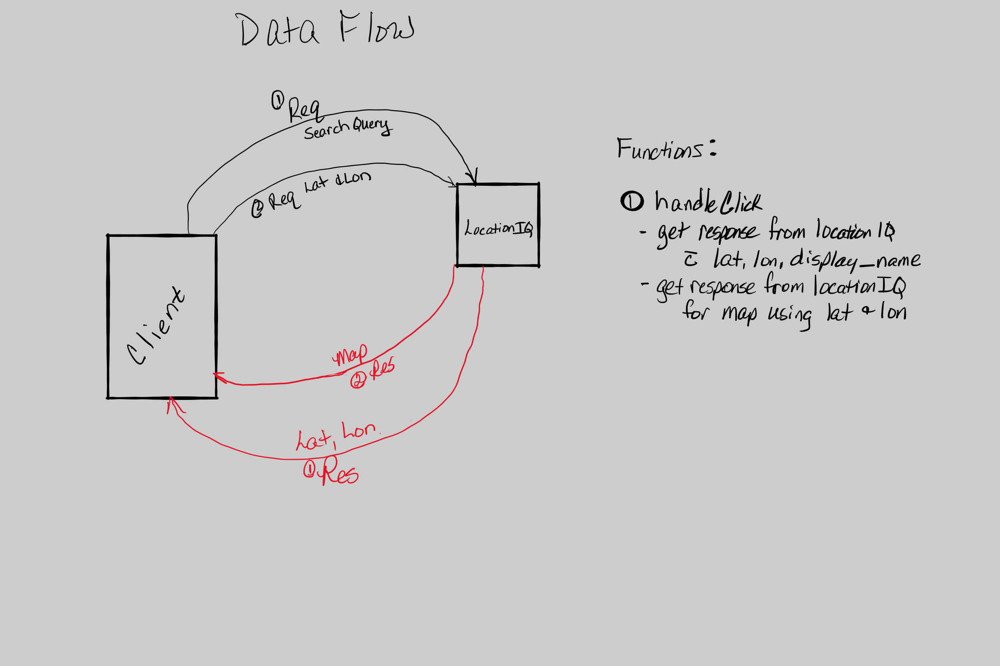
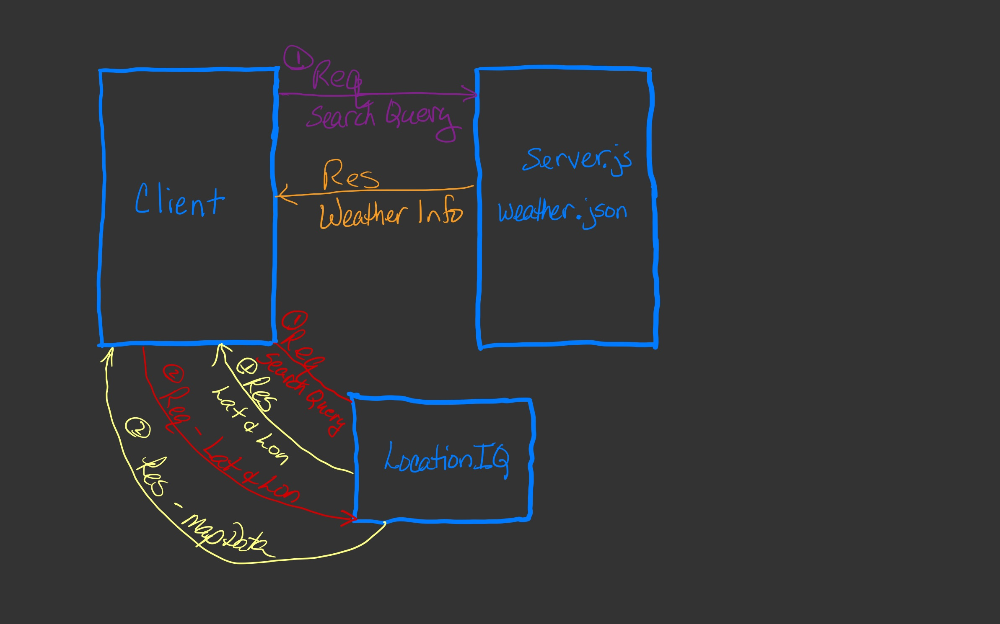
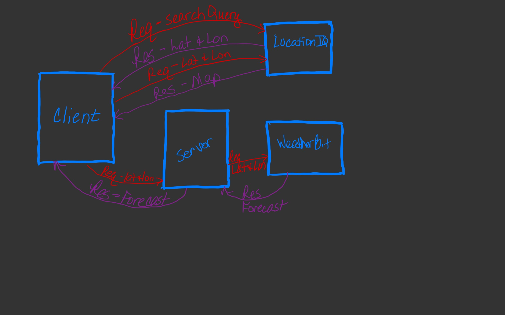

# City Explorer

## Netlify Badge and Link

[City Explorer](<https://city-explorer-hijinx.netlify.app/>)

**Author**: Rachel Freeland
**Version**: 1.0.0 (increment the patch/fix version number if you make more commits past your first submission)

## Overview
<!-- Provide a high level overview of what this application is and why you are building it, beyond the fact that it's an assignment for this class. (i.e. What's your problem domain?) -->
This app will take in a city name and return the latitude and longitude along with a map of the area.

## Getting Started
<!-- What are the steps that a user must take in order to build this app on their own machine and get it running? -->
Clone the repo to your machine and run 'npm i' to install and/or update the necessary packages onto your machine. You will also need to get an API key from LocationIQ and The MovieDB (put these in your `.env` file that you create on the root directory). In the `.env` file, on Line 1 enter `REACT_APP_LOCATION_API=place your key from the provider here` (no spaces around the `=`) on Line 2 enter `REACT_APP_BACKEND=http://localhost:3002`

## Architecture
<!-- Provide a detailed description of the application design. What technologies (languages, libraries, etc) you're using, and any other relevant design information. -->
- This app is created with javaScript and React.js
- Axios
- Location API
- The MovieDB API

## Credit and Collaborations
<!-- Give credit (and a link) to other people or resources that helped you build this application. -->
- On Monday August 23, 2021: Sarah Creager
- On Tuesday August 24, 2021: Marquessa Asmussen
- On Wednesday August 25, 2021: Justin Hammerly
- On Thursday August 26, 2021: Ryan Emmans

## Web Request Response Cycle

- 
- 
- 

## Time Estimates

### Name of feature: Locations - Adding the ability to find latitude & Longitude of a location

Estimate of time needed to complete: approx. 1 hour

Actual time needed to complete: 45mins.

------------------------------------------------------------------------------------------------

***Name of feature: Errors - Adding error messages in case there is a problem***

Estimate of time needed to complete: 30min

Actual time needed to complete: 20 mins.

------------------------------------------------------------------------------------------------

***Name of feature: Map - Adding a map of the city the user searched***

Estimate of time needed to complete: 30 mins.

Actual time needed to complete: 30 mins.

------------------------------------------------------------------------------------------------

***Name of feature: Weather - Adding weather data for the city the user searched***

Estimate of time needed to complete: 2 to 3 hours

Actual time needed to complete: 2 hours

------------------------------------------------------------------------------------------------

***Name of feature: Movies - Adding movies related to the city the user searched***

Estimate of time needed to complete: 3 to 4 hours

Actual time needed to complete: 3.5 hours
